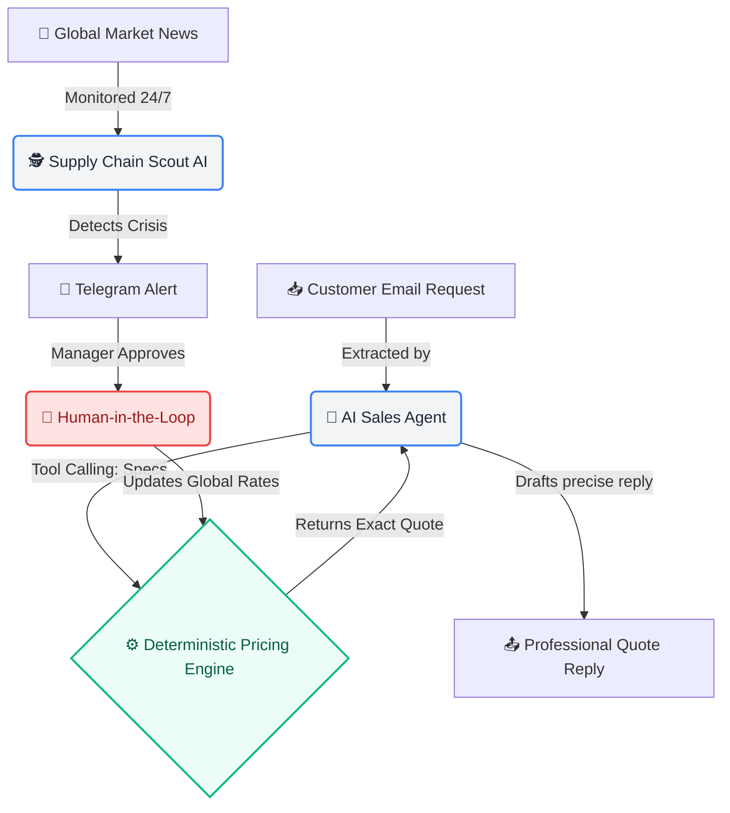

# Maxx.ai 🚀

**An Intelligent PCB Pricing Engine & AI Sales Copilot for B2B Manufacturing**

Maxx.ai revolutionizes traditional B2B manufacturing quoting. By combining **deterministic mathematics** with **autonomous AI agents**, it completely eliminates manual calculation errors, radically speeds up email response times, and autonomously protects profit margins from sudden supply chain disruptions.

## 🌟 Key Features

### 1. Deterministic Pricing Engine
Unlike typical LLMs that hallucinate numbers, Maxx.ai relies on a hard-coded, math-based pricing engine. It accurately calculates base costs, area multipliers, thickness factors, and applies complex logic like expedite multipliers and volume discounts. Every single quote is mathematically grounded and completely reliable.

### 2. AI Email Copilot (Tool-Calling)
Seamlessly integrated into the sales inbox, our AI agent reads inbound customer emails, automatically extracts complex PCB specifications (e.g., layers, thickness, quantity), and uses advanced Tool-Calling to pass these parameters to the Pricing Engine. It then drafts a professional, highly accurate response in seconds.

### 3. Supply Chain Scout (Human-in-the-Loop)
Maxx.ai features an autonomous background agent that constantly monitors global industry news. If a supply chain shock occurs (e.g., a factory explosion affecting copper prices), the system immediately:
- Shifts to a **High Risk** alert state.
- Sends an urgent Telegram notification to the manager.
- Proposes precise mathematical adjustments to the pricing indices.
- Waits for **Human Authorization** before securely updating global pricing, preventing unilateral AI actions while protecting margins.

---

## 🏗️ System Architecture & Workflow



## 🚀 Getting Started

1. **Install Dependencies**
   Make sure you have Python 3 installed. Install the required packages via `pip`.
2. **Run the API Server**
   Start the backend engine from the root directory:
   ```bash
   python3 -m uvicorn api.main:app --host 127.0.0.1 --port 8010
   ```
3. **Open the Dashboard**
   Open your browser and navigate to `http://127.0.0.1:8010` to access the Pricing Engine and the Inbox interface.
